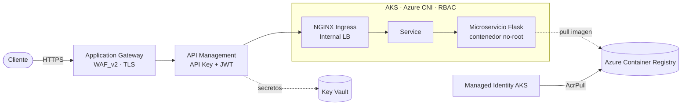

# Azure AKS Microservice Platform

Plataforma de referencia que despliega un microservicio REST en **Azure** de extremo a
extremo con **Infraestructura como Código**: red, registro de contenedores, clúster
**AKS**, y una capa de exposición con **API Management + Application Gateway (WAF)**.
Todo versionado, modular y con un pipeline **CI/CD** en Azure DevOps.

> Proyecto personal de portafolio. El objetivo es mostrar decisiones de arquitectura,
> IaC y buenas prácticas de seguridad cloud, no un producto en producción.

---

## Qué demuestra este proyecto

| Área | Contenido |
|---|---|
| **IaC / Terraform** | Módulos separados por ciclo de vida (red → ACR → AKS), `data sources` entre módulos, variables tipadas y validadas, `outputs` marcados como `sensitive`, backend remoto en Azure Storage con autenticación Entra ID |
| **Kubernetes / AKS** | Azure CNI, RBAC, OIDC issuer + Workload Identity, node pools system/user separados, NGINX Ingress con Internal Load Balancer, HPA |
| **Contenedores** | Imagen mínima, usuario **no-root**, `readOnlyRootFilesystem`, `drop: ALL` de capabilities, `seccomp: RuntimeDefault`, límites de CPU/memoria, probes, servidor WSGI de producción (gunicorn) |
| **Redes y borde** | Segmentación en subredes dedicadas (AKS, Ingress, APIM, App Gateway, Private Endpoint), NSGs con service tags, App Gateway **WAF_v2 en modo Prevention**, TLS 1.2 mínimo |
| **Seguridad** | Sin secretos en el árbol de código ni en el estado; API keys/JWT vía Key Vault y variables `TF_VAR_*`; ACR sin usuario admin (autenticación por managed identity / AcrPull); escaneo de secretos e IaC en CI ([SECURITY.md](SECURITY.md)) |
| **CI/CD** | Pipeline `validate → plan → apply` en Azure DevOps, artefacto de plan, **aprobación manual** por *environment* antes de aplicar |
| **API Gateway** | APIM como gateway lógico: validación de API Key (`X-Parse-REST-API-Key`) y `validate-jwt`, routing al backend |

---

## Arquitectura



---

## Estructura del repositorio

```
.
├── 1. App/            Microservicio Flask + Dockerfile + manifiesto de despliegue
├── 2. Network/        Terraform: VNet y subredes
├── 3. AKS/            Terraform: clúster AKS (consume la red del módulo 2)
├── 4. ACR/            Terraform: Container Registry + integración AcrPull con AKS
├── SolucionCloud/     Diseño completo: RG, red, AKS, Key Vault, APIM, App Gateway,
│                      manifiestos K8s (deploy, service, ingress, HPA) y pipeline CI/CD
├── Guia.sh            Comandos paso a paso (instalación de herramientas y despliegue)
├── SECURITY.md        Política de seguridad y manejo de secretos
└── .github/workflows/ Escaneo de secretos (gitleaks) e IaC (Checkov) en cada push/PR
```

Los módulos `1–4` son un recorrido incremental; `SolucionCloud/` es la solución
integrada de referencia.

---

## Stack técnico

**Azure:** AKS · ACR · Virtual Network · API Management · Application Gateway (WAF_v2) ·
Key Vault · Managed Identity
**IaC / tooling:** Terraform (azurerm ~> 4.0) · Helm · Azure CLI · kubectl
**App:** Python 3.12 · Flask · gunicorn · Docker
**CI/CD:** Azure DevOps Pipelines · gitleaks · Checkov

---

## Despliegue rápido

Requisitos: Terraform ≥ 1.6, Azure CLI, `kubectl`, Docker y una suscripción de Azure.

```bash
git clone https://github.com/terickiza/cloud_project.git
cd cloud_project
az login

# Estado remoto: copiar backend.hcl.example -> backend.hcl en cada módulo y ajustar.

# Orden: red -> ACR -> AKS
terraform -chdir="2. Network" init -backend-config=backend.hcl && terraform -chdir="2. Network" apply
terraform -chdir="4. ACR"     init -backend-config=backend.hcl && terraform -chdir="4. ACR" apply
terraform -chdir="3. AKS"     init -backend-config=backend.hcl && terraform -chdir="3. AKS" apply

# Imagen del microservicio
az acr login --name <tu-acr>
docker build -t <tu-acr>.azurecr.io/devops-api:v1 "1. App"
docker push <tu-acr>.azurecr.io/devops-api:v1

# Despliegue en AKS
az aks get-credentials -g <tu-rg> -n <tu-aks>
kubectl apply -f "1. App/deployment_ms01.yaml"
```

Destrucción en orden inverso: `AKS → ACR → Network`.

### Contrato de la API

`POST /DevOps` con cuerpo **exacto**:

```json
{ "message": "This is a test", "to": "Juan Perez", "from": "Rita Asturia", "timeToLifeSec": 45 }
```

Respuesta `200`: `{ "message": "Hello Juan Perez your message will be sent" }`
Cualquier otro método o cuerpo inválido → `{ "error": "ERROR" }`.

---

## Seguridad

Este repositorio es público y aplica las prácticas descritas en **[SECURITY.md](SECURITY.md)**:
sin estado ni planes de Terraform versionados, sin secretos en `.tf`, `.gitignore`
endurecido, y escaneo automático de secretos e IaC en CI.

---

## Autor

**Erick Iza** — [@terickiza](https://github.com/terickiza) · terickiza@gmail.com

Publicado bajo licencia MIT.
